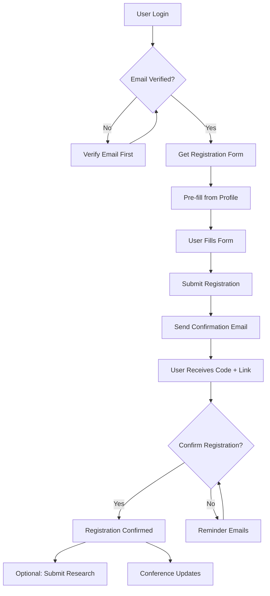

# SOBIE Conference Registration System

## Overview

The SOBIE Conference Registration System provides a comprehensive solution for managing conference registrations with email verification, confirmation workflows, and administrative oversight. The system is designed to handle the complete registration lifecycle from initial signup through confirmation and attendance tracking.

## Key Features

### For Users
- **Profile-Based Registration**: Pre-fills form data from user profile
- **Email Verification Required**: Must have verified email before registration
- **Confirmation Workflow**: Email confirmation with code and direct link
- **Update Capability**: Can update registration details before confirmation
- **Status Tracking**: View registration status in user profile
- **Optional Research Submission**: Separate step after registration confirmation

### For Administrators
- **Dashboard Analytics**: Registration statistics and trends
- **Advanced Filtering**: Filter by status, discipline, attendance type, etc.
- **Export Capabilities**: Data export for external analysis
- **Follow-up Management**: Identify pending confirmations needing attention

## Registration Workflow



## API Endpoints

### Public Endpoints

#### Get Current Conference
```http
GET /api/conference/current
```
Returns current conference information including dates, location, and registration status.

#### Confirm Registration
```http
POST /api/conference/confirm
Content-Type: application/json

{
  "confirmationCode": "ABC12345"
}
// OR
{
  "confirmationToken": "long-hex-token"
}
```

### User Endpoints (Authentication Required)

#### Get Registration Status
```http
GET /api/conference/my-registration
Authorization: Bearer <token>
```

#### Get Registration Form
```http
GET /api/conference/registration-form
Authorization: Bearer <token>
```
Returns pre-filled form data from user profile and form options.

#### Submit Registration
```http
POST /api/conference/register
Authorization: Bearer <token>
Content-Type: application/json

{
  "registrationInfo": {
    "personalInfo": {
      "firstName": "John",
      "lastName": "Doe",
      "email": "john@example.com",
      "phone": "555-0123"
    },
    "affiliation": {
      "organization": "University ABC",
      "department": "Computer Science",
      "position": "Professor"
    },
    "professional": {
      "discipline": "information_systems",
      "academicLevel": "faculty",
      "yearsExperience": 10,
      "researchInterests": ["Database Systems", "AI"]
    }
  },
  "preferences": {
    "attendanceType": "in_person",
    "sessionInterests": ["keynote", "research_presentations"],
    "emergencyContact": {
      "name": "Jane Doe",
      "relationship": "Spouse",
      "phone": "555-0124"
    }
  },
  "additionalInfo": {
    "firstTimeAttendee": false,
    "previousSOBIEYears": [2023, 2024],
    "howDidYouHear": "previous_attendee"
  }
}
```

#### Update Registration
```http
PUT /api/conference/registration
Authorization: Bearer <token>
Content-Type: application/json

{
  "preferences": {
    "attendanceType": "hybrid"
  }
}
```
Note: Only allowed before confirmation.

#### Resend Confirmation
```http
POST /api/conference/resend-confirmation
Authorization: Bearer <token>
```

#### Cancel Registration
```http
POST /api/conference/cancel
Authorization: Bearer <token>
Content-Type: application/json

{
  "reason": "Schedule conflict"
}
```

### Admin Endpoints (Admin Role Required)

#### Registration Statistics
```http
GET /api/conference/admin/stats?year=2025
Authorization: Bearer <admin-token>
```

#### All Registrations
```http
GET /api/conference/admin/registrations
Authorization: Bearer <admin-token>

Query Parameters:
- year: Conference year (default: current year)
- status: pending, confirmed, cancelled, waitlisted
- discipline: accounting, analytics, information_systems, etc.
- attendanceType: in_person, virtual, hybrid
- confirmed: true/false
- page: Page number (default: 1)
- limit: Results per page (default: 50)
```

## Data Models

### Conference Registration Schema

```javascript
{
  // Conference Information
  conference: {
    year: Number,
    name: String,
    startDate: Date,
    endDate: Date,
    location: {
      venue: String,
      city: String,
      state: String,
      country: String
    },
    registrationDeadline: Date,
    isActive: Boolean
  },

  // User Reference
  user: ObjectId,

  // Registration Details
  registrationInfo: {
    personalInfo: {
      firstName: String,
      lastName: String,
      email: String,
      phone: String
    },
    affiliation: {
      organization: String,
      department: String,
      position: String,
      address: {
        street: String,
        city: String,
        state: String,
        zipCode: String,
        country: String
      }
    },
    professional: {
      discipline: String, // enum
      academicLevel: String, // enum
      yearsExperience: Number,
      researchInterests: [String]
    }
  },

  // Status and Confirmation
  status: String, // pending, confirmed, cancelled, waitlisted
  confirmation: {
    code: String, // 8-character code
    isConfirmed: Boolean,
    confirmedAt: Date,
    confirmationToken: String, // 64-character token
    confirmationTokenExpires: Date,
    confirmationEmailSent: Boolean,
    confirmationEmailSentAt: Date
  },

  // Preferences
  preferences: {
    attendanceType: String, // in_person, virtual, hybrid
    sessionInterests: [String],
    dietaryRestrictions: [String],
    accessibilityNeeds: String,
    emergencyContact: {
      name: String,
      relationship: String,
      phone: String,
      email: String
    }
  },

  // Additional Information
  additionalInfo: {
    firstTimeAttendee: Boolean,
    previousSOBIEYears: [Number],
    howDidYouHear: String, // enum
    specialRequests: String,
    marketingOptIn: Boolean
  },

  // Research Submission Status
  researchSubmission: {
    hasSubmitted: Boolean,
    submissionId: ObjectId,
    submissionStatus: String
  },

  // Administrative
  admin: {
    registeredBy: ObjectId,
    notes: String,
    tags: [String],
    reviewStatus: String,
    reviewedBy: ObjectId,
    reviewedAt: Date
  }
}
```

## Email Templates

### Registration Confirmation Email
Sent immediately after registration with:
- Welcome message
- Confirmation code (8 characters)
- Direct confirmation link
- Conference details
- Next steps

### Registration Confirmed Email
Sent after successful confirmation with:
- Confirmation success message
- Conference information
- Optional research submission link
- What to expect next

### Registration Cancelled Email
Sent when user cancels with:
- Cancellation confirmation
- Reason (if provided)
- Re-registration option

## Security Features

- **Email Verification Required**: Users must verify email before registration
- **Unique Confirmation Codes**: 8-character alphanumeric codes
- **Secure Tokens**: 64-character hex tokens for direct links
- **Token Expiration**: 7-day expiration on confirmation tokens
- **Input Validation**: Comprehensive validation on all inputs
- **Rate Limiting**: Protection against spam registrations
- **Admin Only Access**: Sensitive endpoints require admin role

## Configuration

### Environment Variables
```env
# Frontend URL for confirmation links
FRONTEND_URL=http://localhost:3000

# Email service configuration
SMTP_HOST=smtp.gmail.com
SMTP_PORT=587
SMTP_USER=your-email@gmail.com
SMTP_PASS=your-app-password

# Email safety for development
EMAIL_SERVICE_ENABLED=true
LOG_COMMUNICATION_ATTEMPTS=true
```

### Database Indexes
- `{ user: 1, 'conference.year': 1 }` - Unique constraint
- `{ 'confirmation.confirmationToken': 1 }` - Fast token lookup
- `{ 'confirmation.code': 1 }` - Fast code lookup
- `{ status: 1 }` - Status filtering
- `{ 'conference.year': 1, status: 1 }` - Admin queries

## Testing

### User Testing
```bash
node test-conference-registration.js
```
Tests complete user registration workflow including:
- Getting conference information
- Registration form pre-filling
- Registration submission
- Email confirmation
- Status updates

### Admin Testing
```bash
node test-admin-conference.js
```
Tests admin management features including:
- Registration statistics
- Advanced filtering
- Multi-year analytics
- Attendee analysis

## Integration with Existing Systems

### User Profile Integration
- Pre-fills registration from user profile data
- Updates user profile with conference participation
- Links to user's research submissions

### Research Submission Integration
- Separate optional step after registration confirmation
- Links confirmed registrations to research submissions
- Tracks research submission status in registration

### Suggestion System Integration
- Users can suggest improvements to conference data
- Admin can manage conference-related suggestions
- Links to user participation history

## Analytics and Reporting

### Registration Statistics
- Total registrations by year
- Confirmation rates
- Cancellation rates
- First-time vs returning attendees

### Demographic Analysis
- Discipline distribution
- Academic level breakdown
- Geographic distribution
- Organization representation

### Attendance Planning
- In-person vs virtual attendees
- Dietary restrictions summary
- Accessibility needs tracking
- Emergency contact information

## Payment Management System

### Overview
The payment system provides comprehensive tracking and management of conference registration fees. It supports various payment methods, discount applications, and administrative oversight while maintaining detailed audit trails.

### Payment Features

#### For Users
- **View Payment Status**: See current payment requirements and status
- **Payment History**: View payment transactions and history
- **Multiple Payment Methods**: Support for various payment options
- **Discount Visibility**: See applied discounts and final amounts

#### For Administrators
- **Payment Requirements**: Set payment amounts, due dates, and categories
- **Payment Recording**: Record payments with full transaction details
- **Discount Management**: Apply various discount types and amounts
- **Payment Waiving**: Waive payments for special cases (students, speakers)
- **Refund Processing**: Handle refunds with complete audit trails
- **Financial Reporting**: Comprehensive payment statistics and analytics
- **Payment History**: Complete audit trail of all payment activities

### Payment Methods Supported

1. **Cash** - Payments received at conference
2. **Check** - With check number tracking
3. **Credit Card** - With transaction ID and authorization codes
4. **Purchase Order** - University/corporate PO processing
5. **Wire Transfer** - Electronic transfers
6. **Waived** - Scholarships and special cases
7. **Scholarship** - Academic scholarship programs
8. **Other** - Flexible payment option

### Payment Categories

- **Student** - Undergraduate/graduate student rates (often discounted)
- **Faculty** - Academic faculty standard rates
- **Professional** - Industry professional rates
- **Member** - Organization member discount rates
- **Non-Member** - Standard non-member rates
- **Speaker** - Conference speaker rates (often waived)
- **Sponsor** - Conference sponsor special rates
- **Vendor** - Vendor/exhibitor rates

### Payment Status Types

- **Not Required** - No payment needed
- **Waived** - Payment waived (scholarships, speakers, etc.)
- **Pending** - Payment required but not yet received
- **Partial** - Partial payment received
- **Completed** - Payment received in full
- **Overdue** - Payment past due date
- **Refunded** - Payment refunded
- **Cancelled** - Payment cancelled

### Admin Payment API Endpoints

#### Get Payment Statistics
```http
GET /api/conference/admin/payment-stats?year=2025
Authorization: Bearer <admin-token>
```

Returns comprehensive financial overview including:
- Total revenue and outstanding amounts
- Payment status distribution
- Collection rates
- Payment method distribution
- Category breakdown

#### Update Payment Information
```http
PUT /api/conference/admin/payment/:registrationId
Authorization: Bearer <admin-token>
Content-Type: application/json

// Set payment requirement
{
  "action": "set_payment_required",
  "amount": 150.00,
  "dueDate": "2025-09-30",
  "category": "professional"
}

// Record payment
{
  "action": "record_payment",
  "amount": 150.00,
  "paymentMethod": "check",
  "transactionDetails": {
    "checkNumber": "CHK001234",
    "referenceNumber": "REF-2025-001"
  },
  "notes": "Payment received at registration desk"
}

// Apply discount
{
  "action": "apply_discount",
  "discountData": {
    "discountType": "student",
    "discountPercentage": 50,
    "discountReason": "Student discount - 50% off"
  }
}

// Waive payment
{
  "action": "waive_payment",
  "notes": "Payment waived - keynote speaker"
}

// Process refund
{
  "action": "process_refund",
  "refundData": {
    "refundAmount": 75.00,
    "refundReason": "Conference cancellation",
    "refundMethod": "check",
    "refundTransactionId": "REF-12345"
  }
}
```

#### Get Payment Details
```http
GET /api/conference/payment/:registrationId
Authorization: Bearer <token>
```

Users can view their own payment details; admins can view any registration's payment information.

### Payment Data Model

```javascript
payment: {
  required: Boolean,
  amount: Number,
  status: String, // Enum: not_required, waived, pending, partial, completed, overdue, refunded, cancelled
  
  // Payment Method and Details
  paymentMethod: String, // Enum: cash, check, credit_card, purchase_order, wire_transfer, waived, scholarship, other
  
  // Transaction Details
  transactionDetails: {
    transactionId: String,
    checkNumber: String,
    purchaseOrderNumber: String,
    creditCardLast4: String,
    authorizationCode: String,
    batchNumber: String,
    referenceNumber: String
  },
  
  // Payment Timeline
  dueDate: Date,
  paidAt: Date,
  processedAt: Date,
  
  // Amount Breakdown
  amounts: {
    baseAmount: Number,      // Original amount
    discountAmount: Number,  // Total discounts applied
    taxAmount: Number,       // Tax amount (if applicable)
    processingFeeAmount: Number, // Processing fees
    totalAmount: Number,     // Final amount after discounts
    amountPaid: Number,      // Amount paid so far
    amountDue: Number        // Remaining amount due
  },
  
  // Payment Category and Discounts
  category: String, // Enum: student, faculty, professional, member, non_member, speaker, sponsor, vendor
  
  discountApplied: {
    discountType: String,    // Type of discount
    discountCode: String,    // Discount code used
    discountPercentage: Number, // Percentage discount
    discountAmount: Number,  // Dollar amount discount
    discountReason: String   // Reason for discount
  },
  
  // Administrative Notes
  adminNotes: String,        // Notes visible to users
  internalNotes: String,     // Internal admin notes
  
  // Payment History
  paymentHistory: [{
    date: Date,
    action: String,          // payment_received, payment_processed, etc.
    amount: Number,
    method: String,
    details: String,
    processedBy: ObjectId,   // Admin who processed
    transactionId: String,
    notes: String
  }],
  
  // Refund Information
  refund: {
    refundRequested: Boolean,
    refundRequestedAt: Date,
    refundReason: String,
    refundAmount: Number,
    refundProcessedAt: Date,
    refundTransactionId: String,
    refundMethod: String,
    refundProcessedBy: ObjectId
  },
  
  // Processing Information
  processedBy: ObjectId,     // Admin who last updated
  lastUpdatedBy: ObjectId,   // Last person to update
  lastPaymentUpdate: Date    // Last update timestamp
}
```

### Common Payment Scenarios

#### Student Registration
1. Set payment requirement with student category
2. Apply 50% student discount
3. Often results in waived or minimal payment

#### Corporate Registration
1. Set payment requirement with professional category
2. Record purchase order payment
3. Track PO number and corporate billing details

#### Speaker Registration
1. Set payment requirement initially
2. Waive payment for confirmed speakers
3. Maintain audit trail of waiver

#### Early Bird Discount
1. Set payment requirement with standard amount
2. Apply early bird discount for early registrants
3. Track discount codes and expiration dates

### Testing

Run the payment system test suite:
```bash
node test-payment-system.js
```

This comprehensive test covers:
- Payment statistics and reporting
- Setting payment requirements
- Recording various payment methods
- Applying discounts and waivers
- Payment history tracking
- Financial analytics

### Security and Audit

- **Admin Only Updates**: Only administrators can modify payment information
- **Complete Audit Trail**: All payment actions are logged with timestamps and responsible user
- **Secure Transaction Storage**: Sensitive payment details are properly secured
- **Input Validation**: All payment data is validated before processing
- **Access Control**: Users can only view their own payment details

### Financial Reporting

The system provides comprehensive financial reporting including:
- **Revenue Tracking**: Total revenue by year, category, method
- **Outstanding Balances**: Track unpaid amounts and overdue payments
- **Collection Rates**: Monitor payment collection efficiency
- **Discount Analysis**: Track discount usage and impact
- **Payment Method Distribution**: Analyze preferred payment methods
- **Category Analysis**: Revenue breakdown by attendee category
2. **Waitlist Management**: Automatic waitlist and notification system
3. **Group Registrations**: Allow bulk registration for organizations
4. **Mobile App Integration**: Native mobile registration experience
5. **QR Code Check-in**: Generate QR codes for conference check-in
6. **Calendar Integration**: Add conference dates to attendee calendars
7. **Networking Platform**: Connect attendees before the conference
8. **Session Registration**: Allow registration for specific sessions
9. **Badge Generation**: Automatic generation of conference badges
10. **Post-Conference Surveys**: Feedback collection system

## Support and Maintenance

For technical support or system modifications:
- Review test scripts for expected behavior
- Check email service configuration
- Verify database indexes are properly set
- Monitor confirmation rates and follow up on pending registrations
- Regularly clean up expired confirmation tokens

## Error Handling

The system includes comprehensive error handling for:
- Invalid email addresses
- Duplicate registrations
- Expired confirmation tokens
- Missing required fields
- Database connection issues
- Email service failures

All errors are logged and appropriate user-friendly messages are returned.
